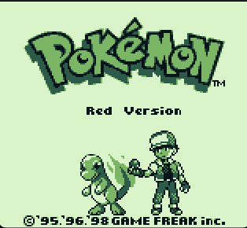

# Rust Gameboy emulation crate

[](https://github.com/nirhaike/rust-gameboy/actions/workflows/build.yml)

A rust crate that emulates the GameBoy/GameBoy Color's Z80-like CPU and it's peripherals, without using rust's standard library (making it suitable for embedded environments).

The crate is currently almost capable of running MBC3 classic gameboy games.

<p align="center"></p>

## Running
In order to run the example emulator, type:
```bash
cargo run --features="display" --example emulator <rom-path>
```

Key bindings: Arrow keys; Enter, Space, Z and X (for START, SELECT, A and B, respectively).

## References
I'm using [Pan Docs](https://gbdev.io/pandocs/), the [Cycle-accurate Game Boy docs](https://github.com/AntonioND/giibiiadvance/blob/master/docs/TCAGBD.pdf), the [Game Boy: Complete Technical Reference](https://gekkio.fi/files/gb-docs/gbctr.pdf), and the [GameBoy CPU Manual](http://marc.rawer.de/Gameboy/Docs/GBCPUman.pdf) as references for the emulation library's development.

## Disclaimer
GAME BOY is a trademark of Nintendo Co., Ltd.

This project was made entirely for fun and non-profit purposes, and for getting experienced in rust.
